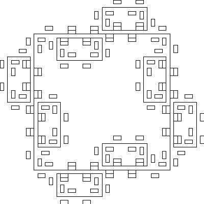

# LindenmayerSystem
Implementing a simple Lindenmayer system and a turtle graphics system.

The folders include:
+ src/curves: includes the grammars shown in the blog post
+ src/lsystems: includes the grammar execution and defining the grammar code
+ src/lsystems/two_dim: includes the code for turtle graphics

